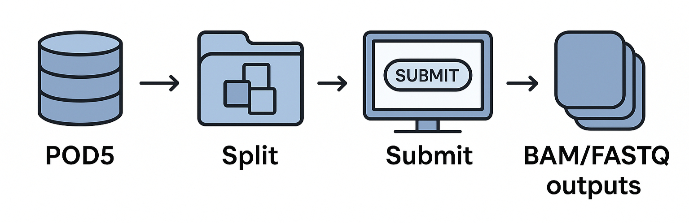

# tutorial-ONT-Basecalling
# Long-Read Genomics on the OSPool

This tutorial guides you through the first step of a long-read sequencing analysis workflow — basecalling — using Oxford Nanopore data on the OSPool high-throughput computing ecosystem. You will learn how to:

* Basecall raw Nanopore reads using the latest GPU-accelerated Dorado basecaller  
* Use the OSPool's GPU capacity to accelerate basecalling with Dorado  
* Break down massive bioinformatics workflows into many independent smaller tasks  
* Submit hundreds to thousands of jobs with a few simple commands  
* Use the Open Science Data Federation (OSDF) to manage file transfers during job submission  

All of these steps run across hundreds (or thousands) of jobs using the HTCondor workload manager and Apptainer containers to execute your software reliably and reproducibly at scale. The tutorial uses realistic genomics data and emphasizes performance, reproducibility, and portability. You will work with real data and see how high-throughput computing (HTC) can accelerate your workflows.



> [!NOTE]
> If you are new to running jobs on the OSPool, complete the HTCondor ["Hello World"](https://portal.osg-htc.org/documentation/htc_workloads/workload_planning/htcondor_job_submission/) exercise before starting this tutorial.

**Let’s get started!**

<!-- TOC start (generated with https://github.com/derlin/bitdowntoc) -->

- [tutorial-ONT-Basecalling](#tutorial-ont-basecalling)
- [Long-Read Genomics on the OSPool](#long-read-genomics-on-the-ospool)
   * [Tutorial Setup](#tutorial-setup)
      + [Assumptions](#assumptions)
      + [Materials](#materials)
   * [Understanding Basecalling in Oxford Nanopore Sequencing](#understanding-basecalling-in-oxford-nanopore-sequencing)
      + [From Signal to Sequence: The Role of Basecalling](#from-signal-to-sequence-the-role-of-basecalling)
   * [Basecalling on the OSPool by Sequencing Channel](#basecalling-on-the-ospool-by-sequencing-channel)
   * [Recommended Directory Structure](#recommended-directory-structure)
   * [Basecalling Oxford Nanopore Long Reads Using Dorado](#basecalling-oxford-nanopore-long-reads-using-dorado)
      + [Set Up Your Software Environment](#set-up-your-software-environment)
      + [Data Wrangling and Splitting Reads](#data-wrangling-and-splitting-reads)
         - [Downloading the Dorado Basecalling Models](#downloading-the-dorado-basecalling-models)
         - [Split Your Reads for Basecalling](#split-your-reads-for-basecalling)
      + [Submit Your Basecalling Jobs](#submit-your-basecalling-jobs)
      + [Post-Basecalling Steps](#post-basecalling-steps)
   * [Next Steps](#next-steps)
      + [Software](#software)
      + [Data](#data)
      + [GPUs](#gpus)
   * [Getting Help](#getting-help)

<!-- TOC end -->


## Tutorial Setup

### Assumptions

This tutorial assumes that you:

* Have basic command-line experience (e.g., navigating directories, using bash, editing text files)
* Have a working OSPool account and can log into an Access Point (e.g., ap40.uw.osg-htc.org)
* Are familiar with HTCondor job submission, including writing simple `.sub` files and tracking job status with `condor_q`
* Understand the general workflow of long-read sequencing analysis: basecalling → mapping → variant calling
* Have access to a machine with a GPU-enabled execution environment (provided automatically via the OSPool)
* Have sufficient disk quota and file permissions in your OSPool home and OSDF directories

> [!TIP]
> You do not need to be a genomics expert to follow this tutorial. The commands and scripts are beginner-friendly and self-contained while reflecting real-world research workflows.

### Materials

To obtain a copy of the tutorial files, you can:

* Clone the repository:

  ```bash
  git clone https://github.com/dmora127/tutorial-ONT-Basecalling.git
  ./tutorial-setup.sh <username>
  ```
  _This script creates the directory structure in your home directory `/home/<user.name>/tutorial-ONT-Basecalling/` and OSPool directory `/ospool/ap40/<user.name>/tutorial-ONT-Basecalling/`, along with several subdirectories used in this tutorial._

* Or download the toy dataset using Pelican:

  ```bash
  pelican object get pelican://osg-htc.org/ospool/uw-shared/OSG-Staff/osg-training/tutorial-ospool-genomics/data/path/to/pod5/files ./
  ```


## Understanding Basecalling in Oxford Nanopore Sequencing

In Oxford Nanopore Technologies (ONT) sequencing, the instrument does not directly read DNA or RNA bases. Instead, it measures subtle changes in ionic current as a single-stranded molecule passes through a nanopore embedded in a membrane. These electrical current traces—often called raw signals or squiggles—reflect the sequence-dependent resistance patterns of the nucleotides inside the pore.

### From Signal to Sequence: The Role of Basecalling

Basecalling converts continuous electrical signals into nucleotide sequences (A, C, G, T, or U). Basecalling algorithms interpret the temporal and amplitude patterns in the current signal to infer the most probable sequence of bases. This step is one of the most computationally demanding parts of the ONT analysis pipeline.

Dorado uses deep neural network models trained to map signal patterns to their corresponding base sequences. These models rely on GPU acceleration to perform millions of operations per second. GPUs dramatically shorten inference time by parallelizing the math behind neural network prediction, enabling accurate and high-throughput decoding of long-read data.

Because each read or POD5 file can be basecalled independently, Dorado workflows scale perfectly on the OSPool, where thousands of GPU-enabled jobs can run simultaneously. The OSPool’s distributed architecture provides the compute, memory, and data-staging infrastructure (via OSDF) needed to handle large sequencing runs reproducibly and efficiently. You can turn hours of local computation into minutes of parallel basecalling across the national HTC fabric.


## Basecalling on the OSPool by Sequencing Channel

When performing simplex basecalling with Dorado, reorganize your raw data by sequencing channel before submitting jobs to the OSPool. Each Oxford Nanopore flow cell contains hundreds to thousands of channels that generate independent signal traces, meaning the data in a single POD5 file can be subdivided into smaller, channel-specific subsets.

By splitting the data so that each channel’s reads are in their own POD5 file, you enable true parallel basecalling: each channel file becomes an independent job that can run simultaneously across hundreds or thousands of OSPool execution points. This design aligns with the principles of High Throughput Computing (HTC)—many small, independent jobs working together to accelerate large workflows. Channel-level splitting also enables duplex basecalling, which requires organizing data to pair complementary reads, maximizing accuracy and yield.

Use the POD5 package available inside your `dorado.sif` container to generate per-channel subsets and organize them into a `split_pod5_subsets` directory. Once subdivided, each new POD5 file can be basecalled individually, dramatically reducing time-to-results while maintaining reproducibility and scalability on the OSPool.


## Recommended Directory Structure

Use a layout like the one below (directories may already exist if you ran the setup script):

```bash
ont-basecalling/
├── executables/               # helper scripts
├── inputs/                    # POD5 inputs (or OSDF paths to them)
├── logs/                      # condor .log/.out/.err
├── outputs/                   # basecalled outputs (BAM/FASTQ)
├── software/                  # containers, model tarballs, helper assets
├── list_of_pod5_files.txt     # one POD5 path per line
├── run_dorado.sub             # HTCondor submit file (GPU)
└── tutorial-setup.sh          # optional helper to set up the tree
```

You also have a companion **OSDF** directory for storing large files, such as containers and Dorado models:

```bash
/ospool/<ap##>/data/<your-username>/tutorial-ONT-Basecalling/
├── data/
│   ├── dna_r10.4.1_e8.2_400bps_fast@v4.2.0_5mCG_5hmCG@v2.tar.gz
│   ├── dna_r10.4.1_e8.2_400bps_fast@v4.2.0.tar.gz
│   ├── rna004_130bps_sup@v5.2.0.tar.gz
├── software/
│   └── dorado_build1.2.0_27OCT2025_v1.sif
```

Run the included `tutorial-setup.sh` script in the companion repository to create this structure.

## Basecalling Oxford Nanopore Long Reads Using Dorado

### Set Up Your Software Environment
Before basecalling, set up your software environment to run Dorado inside an Apptainer container.

1. Log into your OSPool account:

    ```bash
    ssh user.name@ap##.uw.osg-htc.org
    ```

2. Set your temporary Apptainer build directory to `/home/tmp/`. Once you've built your container, you can delete the contents of this directory to reduce quota usage on `/home`. 

   On the Access Point (AP), run:
    ```bash
    mkdir -p $HOME/tmp
    export TMPDIR=$HOME/tmp
    export APPTAINER_TMPDIR=$HOME/tmp
    export APPTAINER_CACHEDIR=$HOME/tmp
    ```
> [!CAUTION]
> Run these commands **every time you log in or build a new container**. Building Apptainer containers without setting these variables places excessive strain on shared storage resources and **violates OSPool usage policies**. Failure to follow these steps may result in restricted access.

3.  Create a definition file for Apptainer to build your Dorado container. Open a text editor, such as `vim` or `nano`, and save the following as `dorado.def`:

    ```bash
    Bootstrap: docker
    From: nvidia/cuda:13.0.1-cudnn-runtime-ubuntu22.04
    
    %post
        DEBIAN_FRONTEND=noninteractive
    
        # system packages
        apt-get update -y
        apt-get install -y python3-minimal curl
        curl -sS https://bootstrap.pypa.io/get-pip.py -o get-pip.py
        python3 get-pip.py --break-system-packages
        rm get-pip.py 
        apt-get install -y bedtools
    
        # install Dorado and POD5
        cd /opt/
        curl -L https://cdn.oxfordnanoportal.com/software/analysis/dorado-1.2.0-linux-x64.tar.gz -o ./dorado-1.2.0-linux-x64.tar.gz
        tar -zxvf dorado-1.2.0-linux-x64.tar.gz
        rm dorado-1.2.0-linux-x64.tar.gz
    
        # install POD5 using pip
        pip install pod5 --break-system-packages
    
    %environment
        # set up environment for when using the container
        # add Dorado to $PATH variable for ease of use
        export PATH="/opt/dorado-1.2.0-linux-x64/bin/:$PATH"
    ```

    This definition file uses the Nvidia CUDA 13.0.1 libraries on an Ubuntu 22.04 base image and installs necessary packages to run Dorado and POD5 in an Apptainer container.


4. Build your Apptainer container on the Access Point (AP):
    ```bash
    apptainer build dorado_build1.2.0_27OCT2025_v1.sif dorado.def
   ```
   
5. Move your finalized container image, `dorado_build1.2.0_27OCT2025_v1.sif`, to your `OSDF` directory
    
    ```bash
   mv dorado_build1.2.0_27OCT2025_v1.sif /ospool/ap40/data/<user.name>/tutorial-ONT-Basecalling/software/
   ```
   
### Data Wrangling and Splitting Reads

Oxford Nanopore sequencing runs generally yield POD5 files. Each POD5 file is generated about once an hour throughout the
duration of the sequencing run. This output format does not scale very well, as data output usually plateaus after 24-48hrs.
This would mean that POD5 files that are generated from earlier in the sequencing run, will be larger in file size compared to
files later in the run. Additionally, this division of data does not allow for _Duplex_ read basecalling. As a result prior
to running Dorado, we must first reorganize the data contained within all the POD5 files. 


#### Downloading the Dorado Basecalling Models
Dorado basecalling models are not included in the Dorado Apptainer container image by default. As a result, we must download the models we wish to use for basecalling prior to submitting our basecalling jobs. We can download the models directly using the Dorado command line interface (CLI) within our Dorado Apptainer container.

1. Launch an interactive Apptainer shell session on the Access Point (AP) using your `dorado_build1.2.0_27OCT2025_v1.sif` container:
    
   ```bash
    cd /ospool/ap40/data/<user.name>/tutorial-ONT-Basecalling/
    apptainer shell --bind "$PWD" software/dorado_build1.2.0_27OCT2025_v1.sif
   ```

2. Download your desired Dorado model (e.g. `dna_r10.4.1_e8.2_400bps_hac@v5.2.0`) to your `data/` directory in your OSPool tutorial directory:

    ```bash
   dorado download --model dna_r10.4.1_e8.2_400bps_hac@v5.2.0 --models-directory /ospool/ap40/data/<user.name>/tutorial-ONT-Basecalling/data/
    ```

> [!NOTE]  
> This step will download the requested Dorado basecalling model. If you only wish to download specific models, you can replace the `--model dna_r10.4.1_e8.2_400bps_hac@v5.2.0` argument with `--model <model_name>`, where `<model_name>` is the name of the model you wish to download (e.x. `duplex_sup@v5.2.0`). You can also download all the available models (not recommended as there are many models) using the `--model all` option.

3. Exit the Apptainer shell:
    ```bash
    exit
    ```

4. Compress the models into tar.gz files for efficient transfer to the Execution Point (EP) during job submission:

    ```bash
    cd /ospool/ap40/data/<user.name>/tutorial-ONT-Basecalling/data/
    tar -czf dna_r10.4.1_e8.2_400bps_hac@v5.2.0.tar.gz dna_r10.4.1_e8.2_400bps_hac@v5.2.0 && rm -rf dna_r10.4.1_e8.2_400bps_hac@v5.2.0/ 
    ```

Now that your data are organized into channel-specific subsets, you’re ready to submit your jobs to the OSPool.

#### Split Your Reads for Basecalling
When basecalling our sequencing data on Dorado we can subdivide our POD5 files into smaller individual subsets. This subdivision of our files enables us to take advantage of the OSPool's High Throughput Computing (HTC) principles, significantly decreasing the time-to-results for our basecalling. We will use the `POD5` package installed in our `dorado.sif` container—if you need to generate the `dorado.sif` Apptainer image, refer to [Setting up our software environment](#Setting-up-our-software-environment). 

1. Move to your `inputs/` directory where your POD5 files are located:
    ```bash
    cd ~/tutorial-ONT-Basecalling/inputs/
   ```

2. Launch an interactive Apptainer shell session on the Access Point (AP) using your `dorado_build1.2.0_27OCT2025_v1.sif` container:
    ```bash
    apptainer shell --bind "$PWD" /ospool/ap40/data/<user.name>/tutorial-ONT-Basecalling/software/dorado_build1.2.0_27OCT2025_v1.sif
   ```
   
3. Create a table mapping each read ID to its channel:
    ```bash
    pod5 view <pod5_dir> --include "read_id, channel" --output summary.tsv
   ```
   _This will generate a TSV table mapping each read_id to each channel for basecalling. You can change `<pod5_dir>` for `./`, if you're in the current directory with your POD5 files._

4. Subset your POD5 reads by channel using the `summary.tsv` table created in the previous step. Output the POD5 subsets to `split_pod5_subsets/`:
    ```bash
   pod5 subset <pod5_dir> --summary summary.tsv --columns channel --output split_pod5_subsets
   ```
> [!WARNING]  
> This step will take a while depending on the size of your POD5 files and the number of channels present in your data. It will generate one pod5 file per channel in the `split_pod5_subsets` output directory. Most MinION Flow Cells have 512 channels, so you should expect to see ~512 POD5 files in your output directory. **Never output your subsetted POD5 files to your OSPool directory, as it will cause excessive strain on shared storage resources and violate OSPool usage policies.** Only output your subsetted POD5 files to your home directory.
   
5. Exit the Apptainer shell:
    ```bash
   exit
   ```
   _You may have to run `exit` multiple times to exit the Apptainer shell and return to your normal bash shell._
   
6. Create a list of POD5 files to iterate through during job submission:

    ```bash
    ls split_pod5_subsets > ~/tutorial-ONT-Basecalling/list_of_pod5_files.txt
   ```
   
    If you `head` this new file you should see an output similar to this:

    ```
    [user.name@ap40 user.name]$ head ~/tutorial-ONT-Basecalling/list_of_pod5_files.txt
    channel-100.pod5
    channel-101.pod5
    channel-102.pod5
    channel-103.pod5
    channel-104.pod5
    channel-105.pod5
    channel-106.pod5
    channel-107.pod5
    channel-108.pod5
    channel-109.pod5
    [user.name@ap40 user.name]$ 
   ```

### Submit Your Basecalling Jobs


1. Create your Dorado simplex basecalling executable
   `/home/<user.name>/tutorial-ONT-Basecalling/executables/run_dorado.sh`

    ```bash
    #!/bin/bash
    # Run Dorado on the EP for each POD5 file (non-resumeable)
    # Usage: ./run_dorado.sh "<dorado_args>" <dorado_model_name> <input_pod5_file>
    
    set -euo pipefail
    
    DORADO_ARGS="$1"
    DORADO_MODEL_NAME="$2"
    INPUT_POD5="$3"
    BAM_FILE="${INPUT_POD5}.bam"
    FASTQ_FILE="${BAM_FILE}.fastq"
    
    echo "Running Dorado with args: ${DORADO_ARGS}"
    echo "Model Name: ${DORADO_MODEL_NAME}"
    echo "Input POD5: ${INPUT_POD5}"
    echo "Output BAM: ${BAM_FILE}"
    
    # untar your Dorado basecalling models
    tar -xvzf ${DORADO_MODEL_NAME}.tar.gz
    rm ${DORADO_MODEL_NAME}.tar.gz
    echo "Completed model extraction."
    
    # Run Dorado
    dorado ${DORADO_ARGS} "${DORADO_MODEL_NAME}" "${INPUT_POD5}" > "${BAM_FILE}"
    echo "Completed Dorado basecalling."
    
    # Convert BAM to FASTQ
    bedtools bamtofastq -i "${BAM_FILE}" -fq "${FASTQ_FILE}"
    echo "Completed BAM → FASTQ conversion."
   ```

2. Create your submit file 
    `/home/<user.name>/tutorial-ONT-Basecalling/run_dorado.sub`

    ```bash
    container_image        = "osdf:///ospool/ap40/data/<user.name>/tutorial-ONT-Basecalling/software/dorado_build1.2.0_27OCT2025_v1.sif"
    
    DORADO_MODEL = dna_r10.4.1_e8.2_400bps_hac@v5.2.0
    
    executable             = ./executables/run_dorado.sh
    
    # Place your Dorado command (following the Dorado invocation) in the first positional argument
    arguments              = "'basecaller --device cuda:all --batchsize 16 hac@v5.0.0 --models-directory' $(DORADO_MODEL) $(POD5_input_file)"
     
    transfer_input_files   = inputs/split_by_channels/$(POD5_input_file), osdf:///ospool/ap40/data/<user.name>/tutorial-ONT-Basecalling/data/$(DORADO_MODEL).tar.gz
    transfer_output_files  = $(POD5_input_file).bam, $(POD5_input_file).bam.fastq
    transfer_output_remaps = "$(POD5_input_file).bam = ./outputs/basecalledBAMs/$(POD5_input_file).bam; \
                              $(POD5_input_file).bam.fastq = ./outputs/basecalledFASTQs/$(POD5_input_file).bam.fastq"
    
    output                 = ./logs/out/$(POD5_input_file)_$(Process)_basecalling_step2.out
    error                  = ./logs/err/$(POD5_input_file)_$(Process)_basecalling_step2.err
    log                    = ./logs/$(POD5_input_file)_basecalling_step2.log
   
    request_cpus           = 1
    request_disk           = 8 GB
    request_memory         = 24 GB
    retry_request_memory   = RequestMemory*2
    request_gpus           = 1
    
    queue POD5_input_file from list_of_pod5_files.txt
   ```

This submit file will read the contents of `/home/<user.name>/tutorial-ONT-Basecalling/list_of_pod5_files.txt`, iterate through each line, and assign the value of each line to the variable `$POD5_input_file`. This allows you to programmatically submit _N_ jobs, where _N_ equals the number of POD5 subset files you previously created. Each job processes one POD5 channel subset (e.g., `channel-100.pod5`) using your specific Dorado model (e.g., `dna_r10.4.1_e8.2_400bps_hac@v5.2.0.tar.gz`), which are transferred to the Execution Point (EP) by HTCondor. Additionally, the container_image attribute ensures your `dorado_build1.2.0_27OCT2025_v1.sif` Apptainer image is transferred and started for each job.

The submit file will instruct the EP to run your executable `run_dorado.sh` and pass the arguments found in the `arguments` attribute. The `arguments` attribute allows you to customize the parameters passed to _Dorado_ directly on your submit file, without having to edit your executable. 

> [!NOTE]  
> The example submit script above is running the hac@v5.0.0 model for simplex basecalling. You can change this to `duplex sup --models-directory`. For additional usage information, refer to the [Dorado User Documentation](https://github.com/nanoporetech/dorado).

3. Submit your basecalling jobs:

    ```
   condor_submit run_dorado.sub
   ```
   
4. Track your job progress:

    ```
   condor_watch_q
   ```

> [!TIP] 
> If you see `held` jobs (e.g., for memory overruns), use `condor_qedit` to increase resources, then `condor_release` to resume them.
> For more details, see our guide on [Monitor and Review Jobs With condor_q and condor_history](https://portal.osg-htc.org/documentation/htc_workloads/submitting_workloads/monitor_review_jobs/).


### Post-Basecalling Steps

You should now have a directory of basecalled FASTQ and BAM files in your outputs folder. You'll likely want to perform additional steps after basecalling, such as checking read quality, mapping to a reference genome, or calling variants. We recommend merging your basecalled FASTQ files into a single file for downstream analysis. You can do this using the `cat` command:

```
for f in outputs/basecalledFASTQs/*.fastq; do
    cat "$f" >> outputs/merged_basecalled_reads.fastq
done
```

You can use this merged FASTQ file for running FastQC, mapping, or variant calling in the next sections. The recommended next step is to run FastQC to assess the quality of your basecalled reads. You can find a step-by-step tutorial on running [FastQC on the OSPool](https://portal.osg-htc.org/documentation/software_examples/bioinformatics/tutorial-fastqc/) on our documentation portal.

## Next Steps

Now that you've completed this long-read genomics tutorial on the OSPool, you're ready to adapt these workflows for your own data and research questions. Here are some suggestions for what you can do next:

🧬 Apply the Workflow to Your Own Data
* Replace the tutorial datasets with your own POD5 files and reference genome.
* Modify the basecalling, mapping, and variant calling submit files to fit your data size, read type (e.g., simplex vs. duplex), and resource needs.

🧰 Customize or Extend the Workflow
* Incorporate quality control steps (e.g., filtering or read statistics) using FastQC.
* Use other mappers or variant callers, such as ngmlr, pbsv, or cuteSV.
* Add downstream tools for annotation, comparison, or visualization (e.g., IGV, bedtools, SURVIVOR).

📦 Create Your Own Containers
* Extend the Apptainer containers used here with additional tools, reference data, or dependencies.
* For help with this, see our [Containers Guide](https://portal.osg-htc.org/documentation/htc_workloads/using_software/containers/).

🚀 Run Larger Analyses
* Submit thousands of basecalling or alignment jobs across the OSPool.
* Explore data staging best practices using the OSDF for large-scale genomics workflows.
* Consider using workflow managers (e.g., [DAGman](https://portal.osg-htc.org/documentation/htc_workloads/automated_workflows/dagman-workflows/) or [Pegasus](https://portal.osg-htc.org/documentation/htc_workloads/automated_workflows/tutorial-pegasus/)) with HTCondor.

🧑‍💻 Get Help or Collaborate
* Reach out to [support@osg-htc.org](mailto:support@osg-htc.org) for one-on-one help with scaling your research.
* Attend office hours or training sessions—see the [OSPool Help Page](https://portal.osg-htc.org/documentation/support_and_training/support/getting-help-from-RCFs/) for details.

### Software

In this tutorial, we created several *starter* Apptainer containers, including tools like: Dorado, SAMtools, Minimap, and Sniffles2. These containers can serve as a *jumping-off* for you if you need to install additional software for your workflows. 

Our recommendation for most users is to use "Apptainer" containers for deploying their software.
For instructions on how to build an Apptainer container, see our guide [Using Apptainer/Singularity Containers](https://portal.osg-htc.org/documentation/htc_workloads/using_software/containers-singularity/).
If you are familiar with Docker, or want to learn how to use Docker, see our guide [Using Docker Containers](https://portal.osg-htc.org/documentation/htc_workloads/using_software/containers-docker/).

This information can also be found in our guide [Using Software on the Open Science Pool](https://portal.osg-htc.org/documentation/htc_workloads/using_software/software-overview/).

### Data

The ecosystem for moving data to, from, and within the HTC system can be complex, especially if trying to work with large data (> gigabytes).
For guides on how data movement works on the HTC system, see our [Data Staging and Transfer to Jobs](https://portal.osg-htc.org/documentation/htc_workloads/managing_data/overview/) guides.

### GPUs

The OSPool has GPU nodes available for common use, like the ones used in this tutorial. If you would like to learn more about our GPU capacity, please visit our [GPU Guide on the OSPool Documentation Portal](https://portal.osg-htc.org/documentation/htc_workloads/specific_resource/gpu-jobs/).

## Getting Help

The OSPool Research Computing Facilitators are here to help researchers using the OSPool for their research. We provide a broad swath of research facilitation services, including:

* **Web guides**: [OSPool Guides](https://portal.osg-htc.org/documentation/) - instructions and how-tos for using the OSPool and OSDF.
* **Email support**: get help within 1-2 business days by emailing [support@osg-htc.org](mailto:support@osg-htc.org).
* **Virtual office hours**: live discussions with facilitators - see the [Email, Office Hours, and 1-1 Meetings](https://portal.osg-htc.org/documentation/support_and_training/support/getting-help-from-RCFs/) page for current schedule.
* **One-on-one meetings**: dedicated meetings to help new users, groups get started on the system; email [support@osg-htc.org](mailto:support@osg-htc.org) to request a meeting.

This information, and more, is provided in our [Get Help](https://portal.osg-htc.org/documentation/support_and_training/support/getting-help-from-RCFs/) page.
